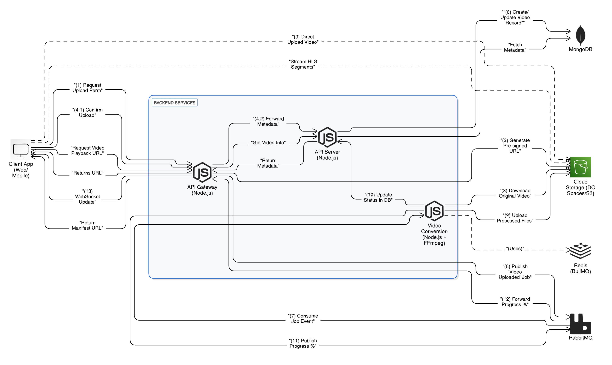

# 🎥 Scallable Video Streaming Platform 🍿 (Work in Progress!)


Hey there! 👋 This project is a cool video streaming service, a bit like a mini-YouTube or Netflix, built using Node.js, Express, React (eventually!), MongoDB, and TypeScript.

**What it does:**

*   Lets users upload videos.
*   Automatically converts those videos into different quality levels (like 480p, 1080p) using a format called HLS (HTTP Live Streaming). This means smoother playback for everyone, even with slower internet!
*   Uses a microservices approach, meaning different parts of the system run as separate small services, making it easier to manage and scale.

## 🌟 Cool Features

*   **Smooth Streaming (Adaptive Bitrate):** Videos play nicely by adjusting quality based on your internet speed. No more endless buffering!
*   **Upload & Forget:** Just upload your video (any common format), and the system handles the conversion magic in the background.
*   **Real-time Updates:** See the progress of your video processing as it happens (thanks to Socket.IO and RabbitMQ).
*   **Cloud Powered:** Videos are stored securely and served efficiently from cloud storage (like AWS S3 or Digital Ocean Spaces).
*   **Built to Grow (Microservices):** The separate services can be updated or scaled independently.

## 🏗️ How It's Built (The Architecture)

Think of the system like a small team working together:

1.  **📡 API Gateway (The Front Door):**
    *   Handles all incoming requests from the app (like upload requests).
    *   Checks if users are logged in (authentication).
    *   Generates secure, temporary links (pre-signed URLs) so users can upload *directly* to cloud storage (faster!).
    *   Sends real-time updates back to the user's screen using WebSockets (Socket.IO).

2.  **📚 API Server (The Librarian):**
    *   Keeps track of all the important info: user details, video titles, descriptions, and processing status.
    *   Stores everything neatly in a MongoDB database.
    *   Listens for updates from other services to keep the video status current.

3.  **🎬 Video Conversion Service (The Video Wizard):**
    *   This is where the heavy lifting happens! It doesn't talk directly to the outside world.
    *   Grabs newly uploaded videos from cloud storage.
    *   Uses the powerful **FFmpeg** tool to convert videos to MP4 (if needed) and then into those HLS formats (480p, 1080p, etc.).
    *   Uses **BullMQ** (with Redis) like a checklist to manage all the conversion steps for each video.
    *   Uploads the final HLS video files back to cloud storage.
    *   Sends status updates ("Processing...", "Converting...", "Done!") via **RabbitMQ** (our internal messenger).

**How they talk:**

*   The services mostly send messages to each other asynchronously using **RabbitMQ**.
*   The **API Gateway** uses **Socket.IO** to send real-time updates directly to the user's browser.

## 🌊 The Flow: From Upload to Playback



Here's a simplified step-by-step of what happens when you upload a video:

1.  **You:** Click "Upload" in the app.
2.  **App:** Asks the **API Gateway** for permission to upload.
3.  **API Gateway:** Gets a temporary, secure upload link (pre-signed URL) from **Cloud Storage**.
4.  **API Gateway:** Sends the link back to your **App**.
5.  **App:** Uploads the video file *directly* to **Cloud Storage** using the special link.
6.  **App:** Tells the **API Gateway**, "Okay, the upload is done!"
7.  **API Gateway:** Tells the **API Server** to save the video info (title, etc.) in **MongoDB** with status "Pending".
8.  **API Gateway:** Sends a message via **RabbitMQ** to the **Video Conversion** service: "New video ready!".
9.  **Video Conversion:** Gets the message, downloads the video from **Cloud Storage**.
10. **Video Conversion:** Starts processing the video using **FFmpeg** (managed by **BullMQ/Redis** queue):
    *   Convert to MP4 (if needed).
    *   Generate Thumbnail.
    *   Convert to HLS (multiple qualities).
11. **Video Conversion:** Sends progress updates ("Converting 50%...") via **RabbitMQ**.
12. **API Gateway:** Gets the progress updates and sends them to your **App** using **Socket.IO**. You see the progress bar move!
13. **Video Conversion:** Finishes processing, uploads the HLS files (.m3u8 playlist and .ts video chunks) back to **Cloud Storage**.
14. **Video Conversion:** Sends a final "Done!" message via **RabbitMQ**.
15. **API Server:** Gets the "Done!" message and updates the video status in **MongoDB** to "Success" and saves the link to the main HLS file (`master.m3u8`).
16. **You:** Click play on the video in the app. The player asks the **API Server** for the video details, gets the HLS link, and starts streaming smoothly from the **Cloud Storage** (likely via a CDN)!

## 🛠️ Tech Stack

*   **Backend:** Node.js, Express.js, TypeScript
*   **Database:** MongoDB (with Mongoose ODM)
*   **Video Processing:** FFmpeg
*   **Messaging:** RabbitMQ
*   **Job Queue:** BullMQ (using Redis)
*   **Real-time Comms:** Socket.IO
*   **Authentication:** JWT (JSON Web Tokens)
*   **Cloud Storage:** AWS S3 / Digital Ocean Spaces / Azure Blob Storage
*   **Containerization:** Docker & Docker Compose

## 🚀 Getting Started

Want to run this project locally? Here's how:

**1. Prerequisites (What you need first):**

*   **Node.js:** Version 18 or higher (`node -v`)
*   **Yarn:** (`yarn -v`) or npm (`npm -v`)
*   **Docker & Docker Compose:** The easiest way to run everything. [Install Docker here](https://docs.docker.com/get-docker/).
*   **FFmpeg:** The video tool. Install it on your system (e.g., `brew install ffmpeg` on Mac, or follow guides for Windows/Linux).
*   **Git:** To download the code (`git --version`).

**2. Clone the Code:**

```bash
git clone https://github.com/AwalHossain/video-streaming-server 
cd video-streaming-server
```

**3. Set Up Environment Variables:**

Each service needs its own configuration (like passwords, API keys).

*   Go into *each* service directory (`api-gateway`, `api-server`, `video-conversion`).
*   Find the `.env.example` file.
*   **Copy** it to a new file named `.env` in the *same* directory.
*   **Edit** each `.env` file and fill in your details (database connection strings, cloud storage keys, JWT secret, etc.).

**4. Run with Docker Compose (Recommended):**

This starts all services (API Gateway, API Server, Video Conversion) AND the dependencies (MongoDB, RabbitMQ, Redis) in containers.

```bash
docker-compose up -d --build
```

*   `--build`: Builds the Docker images the first time.
*   `-d`: Runs the containers in the background (detached mode).

You should see output as the containers start. Check `docker ps` to see running containers.

**5. Run Manually (Alternative):**

If you only want to run dependencies in Docker:

```bash
# Make sure you are in the root directory of the project
docker-compose up -d mongodb rabbitmq redis
```

Then, for *each* service (`api-gateway`, `api-server`, `video-conversion`):

```bash
cd <service-directory>  # e.g., cd api-gateway
yarn install            # Install dependencies
yarn dev                # Start the service in development mode (watches for changes)
cd ..                   # Go back to the root directory
```

**6. Accessing the Services:**

*   **API Gateway:** Usually `http://localhost:8000` (check your `.env` file for the port)
*   **API Server:** Usually `http://localhost:8001`
*   **Video Conversion:** Usually `http://localhost:8002` (Note: This service might not have many accessible HTTP endpoints itself)
*   **RabbitMQ Management:** `http://localhost:15672` (User/Pass often guest/guest by default)

## 📝 Project Status

This project is currently **under development**. Features are being added and improved!

## 📚 Useful Docs

*   [FFmpeg Documentation](https://ffmpeg.org/documentation.html)
*   [RabbitMQ Documentation](https://www.rabbitmq.com/documentation.html)
*   [Socket.IO Documentation](https://socket.io/docs/v4/)
*   [BullMQ Documentation](https://docs.bullmq.io/)
*   [Mongoose Documentation](https://mongoosejs.com/docs/guide.html)

---

Thanks for checking out the project! Stay tuned for more updates.

